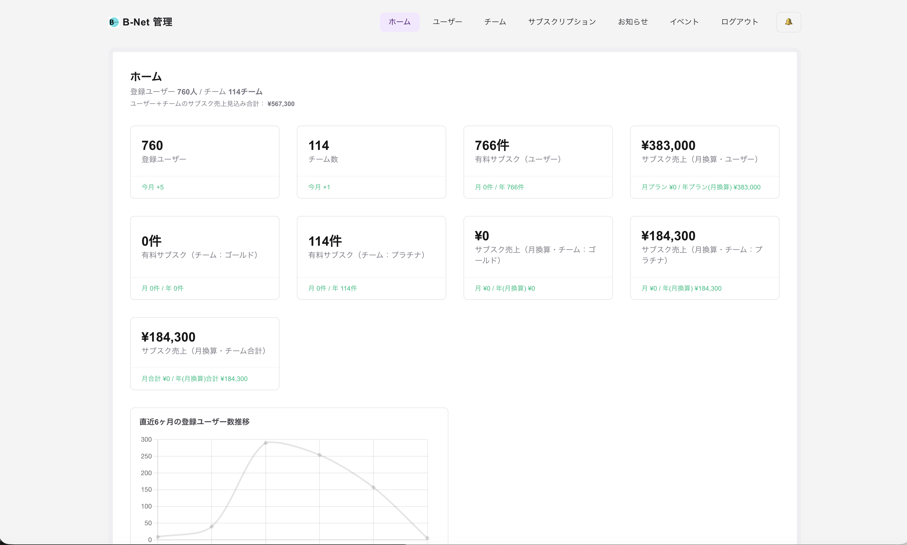

# Baseball Net Admin

Admin dashboard for Baseball Net.

---

## Screenshots

### Admin Dashboard

> Note: The numbers shown in this screenshot are sample data for demonstration purposes only.

---

## Features

- User management
- Team management
- Report moderation
- Subscription management
- Admin notices
- Operational dashboard

---

## Tech Stack

### Frontend

- Next.js
- TypeScript
- React

### Backend

- Firebase

### Deployment

- Vercel

---

## Purpose

This dashboard was built to support the operation and management of the Baseball Net mobile application.

---

## Note

This is an internal admin tool. Public login is not available.

---

## Author

### Shinshun Matayoshi

Flutter Developer from Japan

GitHub:
https://github.com/mata-s
